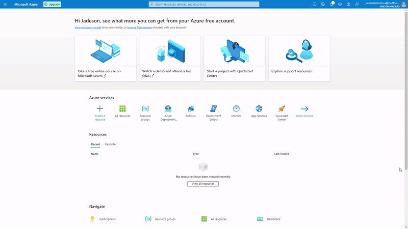
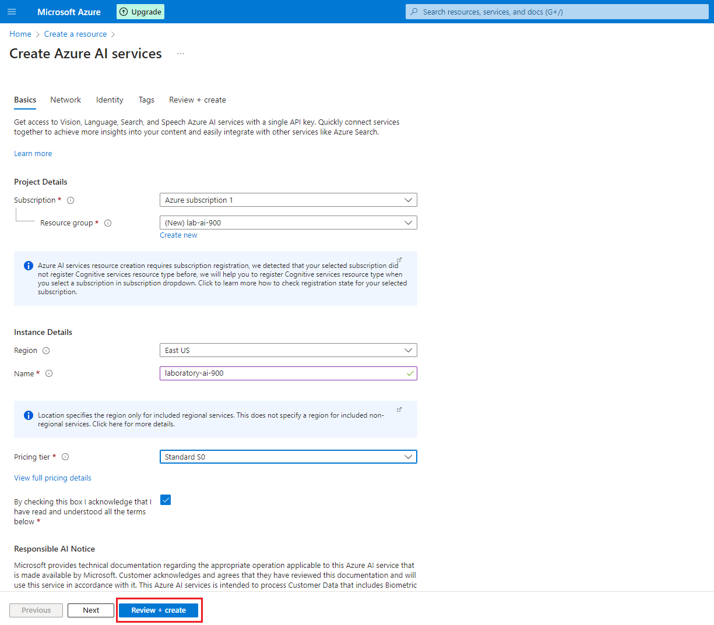
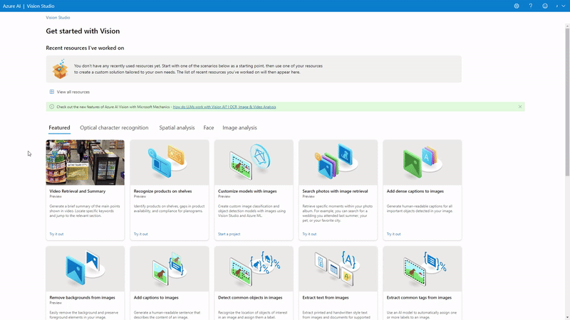
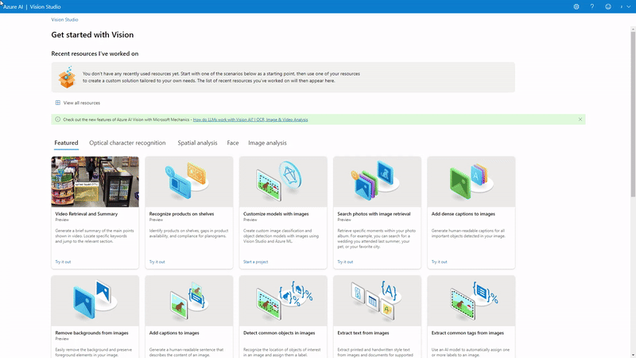
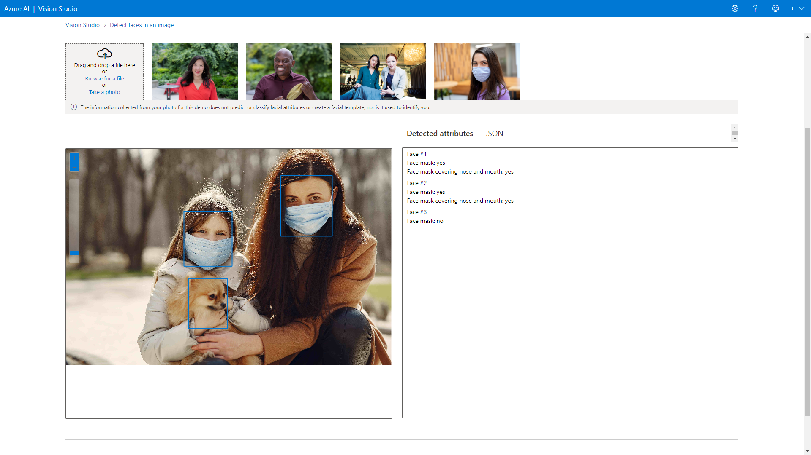
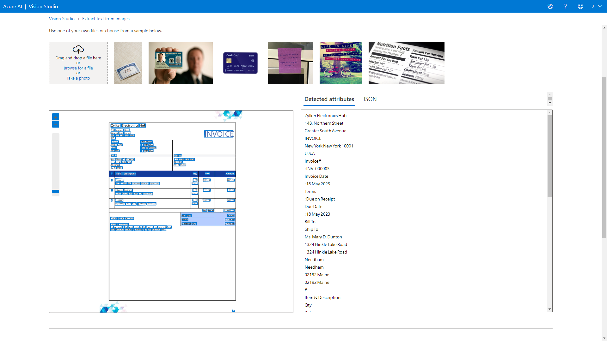
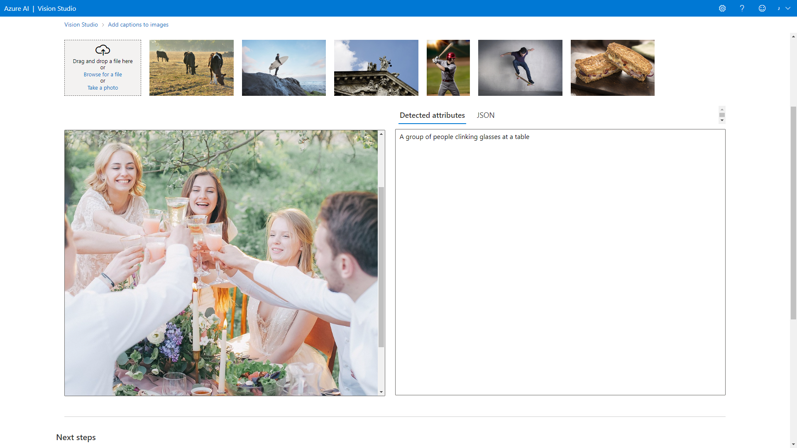

# Facial Recognition and transforming images into Data in Azure ML

This repository has the purpose of storing the project developed within the scope of the "Facial Recognition and transforming images into Data in Azure ML" module of the "Microsoft Azure AI Fundamentals" Bootcamp by [DIO](https://www.dio.me/), under the instruction of the teacher [Valéria Baptista](https://www.linkedin.com/in/valeriabaptista/).

The project is an essential requirement for passing the "Working with Computer Vision" module, consolidating participants practical learning and preparing them for subsequent challenges.

The development of this project aims to demonstrate how facial recognition, data recognition in documents and also image recognition works. For a better understanding, i divided the entire process into steps, from creating the resource group to the final regression result.

## Step 1: Creating a Resource

First, let's create an Azure Machine Learning workspace. To do this, create a Resource and search for Azure AI Services.

  

In the next step, we will configure the Resource and create a new Resource Group if necessary. Since we are in a learning lab, we will not configure other tabs. 

To create we click on "Review + Create" and then "Create".

  

## Step 2: Accessing the Vision Studio portal

Once created, we will access the portal: https://portal.vision.cognitive.azure.com/

We will select a Resource to work on Vision Studio.

  

## Step 4: Detect faces in an image

Let's work with Vision Studio's Face Detection module.

  

By selecting the desired image we can perform facial analysis.

Image Used: [01_facial_analysis.jpg](./inputs/01_facial_analysis.jpg)

  

Attribute Detection:

**Face nº 1** (Mother)

Face mask: yes

Face mask covering nose and mouth: yes

**Face #2** (Daughter)

Face mask: yes

Face mask covering nose and mouth: yes

**Face #3** (Dog)

Face mask: no

It is important to highlight the ability that Computer Vision had to identify different faces, including the face of an animal, and also the faces of people wearing a mask.

You can check the results of the analysis here: [01_facial_analysis.json](./output/01_facial_analysis.json)

## Step 4: Document Analysis

Let's work with Vision Studio's Text Extract from images module.

  

By selecting the desired image we can extract the text.

Image Used: [02_text_extraction.jpg](./inputs/02_text_extraction.jpg)

  

It is possible to observe that the extraction was carried out and all words could be validated by the software.

You can check the results of the analysis here: [02_text_extraction.json](./output/02_text_extraction.json)

## Step 5: Add captions to images

Let's work with Vision Studio's Add Captions to Images module.

  

By selecting the desired image we can add captions to the image.

Image Used: [03_add_caption_to_image.jpg](./inputs/03_add_caption_to_image.jpg)

  

It is possible to observe that the Azure Vision Studio service was able to describe the moment the image passes in an assertive way.

You can check the results of the analysis here: [03_add_caption_to_image.json](./output/03_add_caption_to_image.json)

## Useful Links:

[Azure AI Vision documentation](https://learn.microsoft.com/en-us/azure/ai-services/computer-vision/)

[Custom Vision documentation](https://learn.microsoft.com/en-us/azure/ai-services/custom-vision-service/)

[What is the Azure AI Face service?](https://learn.microsoft.com/en-us/azure/ai-services/computer-vision/overview-identity)

## Tecnologias Utilizadas

- Microsoft Azure AI Vision Studio

## Contributions

Contributions are welcome. Feel free to suggest improvements and possible corrections to the code.

## Author

Jadeson Bruno Albuquerque da Silva

